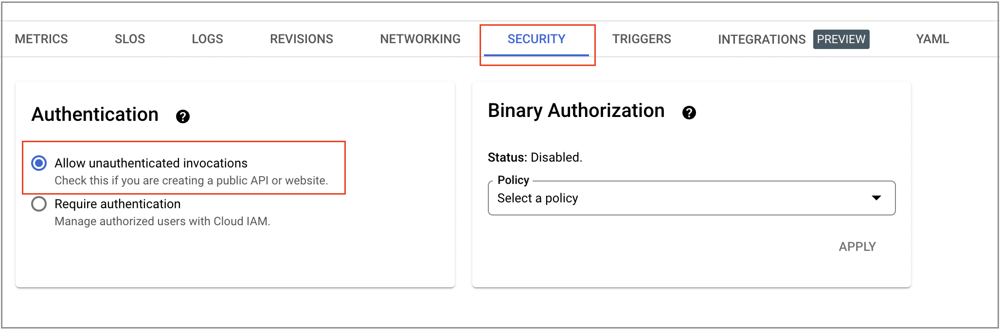

# Automated app deployment to CloudRun using Cloud Deploy

## PREREQUISITES:

##### Installed Software
1. [gcloud](https://cloud.google.com/sdk/gcloud/)
2. [Terraform](https://www.terraform.io/downloads.html)  
3. [kubectl](https://kubernetes.io/docs/tasks/tools/install-kubectl-linux/)

#### Authenticate to gcloud sdk
You can authenticate using GCP IAM using following steps.
- Open the local terminal and use your organization email address for authentication
```
gcloud auth login
gcloud auth application-default login
gcloud config set project <project-id>
```

### A. Things to be deployed initially as a Prerequisite in order to execute above **Cloud Build Trigger**


1. User must have a following permissions and roles to perform the **Prerequisite Steps**:
    - Service Account User - `roles/iam.serviceAccountUser` 
    - Project IAM Admin - `roles/resourcemanager.projectIamAdmin`
    - Service Account Admin - `roles/iam.serviceAccountAdmin`
    - Service Usage Admin - `roles/serviceusage.serviceUsageAdmin`
    - Cloud Build Editor - `roles/cloudbuild.builds.editor`
    - Cloud Deploy Operator - `roles/clouddeploy.operator`
    - Cloud Run Developer - `roles/run.developer`
    - Viewer - `roles/viewer`

2. Create [Google service account](https://cloud.google.com/iam/docs/creating-managing-service-accounts) for running cloud build in the Project.
   
3. [Grant following roles](https://cloud.google.com/iam/docs/granting-changing-revoking-access#grant-single-role) on the above created cloud build SA.

   - Cloud Deploy Developer - `roles/clouddeploy.developer`
   - Cloud Deploy Runner - `roles/clouddeploy.jobRunner`
   - Cloud Deploy Operator - `roles/clouddeploy.operator`
   - Cloud Deploy Approver - `roles/clouddeploy.approver`
   - Cloud Deploy Releaser - `roles/clouddeploy.releaser`
   - Cloud Build Service Account - `roles/cloudbuild.builds.builder`
   - Cloud Build Editor - `roles/cloudbuild.builds.editor`
   - Logs Writer - `roles/logging.logWriter`
   - Cloud Run Developer - `roles/run.developer`
   - Cloud Run Invoker - `roles/run.invoker`
   - Source Repository Administrator - `roles/source.admin`
   - Artifact Registry Administrator - `roles/artifactregistry.admin`
   - Compute Viewer - `roles/compute.viewer`
   - Storage Admin - `roles/storage.admin`

4. [Enable the following APIs](https://cloud.google.com/endpoints/docs/openapi/enable-api#enabling_an_api) from the console.

   - Compute Engine API - `compute.googleapis.com`
   - Cloud Storage API - `storage.googleapis.com`
   - Artifact Registry API - `artifactregistry.googleapis.com`
   - Cloud Source Repositories API - `sourcerepo.googleapis.com`
   - Cloud Build API - `cloudbuild.googleapis.com`
   - Cloud Logging API - `logging.googleapis.com`
   - Cloud Run Admin API - `run.googleapis.com`
   - Google Cloud Deploy API - `clouddeploy.googleapis.com`

5. Create **2** [Google Stotage Bucket](https://cloud.google.com/storage/docs/creating-buckets#create_a_new_bucket) to store terraform state files remotely (centrally).

    1. **Terraform State Bucket** - This bucket will be used to store terraform state files.
    2. **Cloud Build Logs Bucket** - This bucket will be used to store cloud build logs.

6. [Create a Cloud Source Repository](https://cloud.google.com/source-repositories/docs/creating-an-empty-repository#create_a_new_repository). We need a source repository for the purpose of keeping the terraform code and yaml configuration. Beyond the code itself, you can keep things such as documentation, notes, web pages, and other items in your repository. Basically we will be connecting this repo to cloudbuild trigger through which Cloud Build Trigger gets invoked if it found any changes to source code Repo and the job will get executed to the targeted environment.

**Note:** You can use Github/Bitbucket for the same.

7. Create **2** [Artifact Registry](https://cloud.google.com/artifact-registry/docs/repositories/create-repos#create-console) using Google Cloud console with following details.
- **Name**`cd-canary-run-demo`, **Format** `Docker`, **Mode** `Standard`, **Location type** `Region` `us-central`_(To store CloudRun Deployment Image)_.
- **Name**`cd-canary-verify-demo`, **Format** `Docker`, **Mode** `Standard`, **Location type** `Region` `us-central`_(To store Verify Image used in Skaffold for deployment verification purpose)_.

### B. Steps to run terraform modules

1. Clone the [repo](https://github.com/Varsha9630/cloud-deploy-run/tree/automated-canary-deploy-using-cloud-deploy) using [cloud shell](https://cloud.google.com/shell/docs/using-cloud-shell#start_a_new_session)

2. Checkout to `automated-canary-deploy-using-cloud-deploy` branch using `git checkout automated-canary-deploy-using-cloud-deploy`

3. Below files in given path needs to be changed before executing any terraform module
   - **a.** Replace the GCS `<bucket-name>` in the given below file path with the gcs terraform bucket name created above in `Step A.5.(1)`.
      - terraform->env->test->cloud-build-trigger->backend.tf
   - **b.** Replace the GCS `<logs-bucket-name>` in the given below file path with the cloud build logs bucket name created above in `Step A.5(2)`
      - cloud-deploy-canary-run-yamls->cloudbuild.yaml
   - **c.** Replace the `<repo-name>` in the given below file path with the source code repo name created above in `Step A(6)`.
      - terraform->env->test->cloud-build-trigger->terraform.tfvars
   - **d.** Replace `<sa-name>` in the given below file path with the SA name created above in `Step A(2)`.
      - terraform->env->test->cloud-build-trigger->terraform.tfvars
      - cloud-deploy-canary-run-yamls->clouddeploy.yaml
      - anary-run-yamls->myapp-dev.yaml
      - cloud-deploy-canary-run-yamls->myapp-prod.yaml
   - **e.** Replace `<PROJECT_ID>` in the given below file path with your's current `PROJECT_ID`.
      - cloud-deploy-canary-run-yamls->clouddeploy.yaml
      - cloud-deploy-canary-run-yamls->myapp-dev.yaml
      - cloud-deploy-canary-run-yamls->myapp-prod.yaml
      - skaffold.yaml
      - terraform->cloud-build-trigger->terraform.tfvars
      > Note: You can use `terraform.tfvars.sample` file as reference.
 

4. After updating the above commit push your changes back to Google CSR created in above `step A(6)`

5. Run following terraform commands in given directory path `terraform/env/test/cloud-build-triggers`
```
a. terraform init
b. terraform plan
c. terraform apply
```
6. Open the GCP Console. Navigate to the `Cloud Build` section from GCP Console and click on the `Triggers` from the left panel.

7. Search for the Trigger name `demo-cloud-deploy-canary-pipeline`. Next, click on `RUN`. Next click on the `RUN TRIGGER` by specifying the branch name in which you pushed the code in above `step 4(B)`.

**Note:** For the purpose of demo we are running above trigger Manually. But this can be automated as per your need. For the same you can edit your `CloudBuild Trigger` and choose `Push to a branch` from `Evenet Section`. 


8. Open the [Build History page](https://console.cloud.google.com/cloud-build/builds). 

9. Wait till the Triggres get completed.

10. Next open the GCP Console. Navigate to the `Cloud Deploy` and `Cloud Run` section from GCP Console. Check for the first release name `dev` in `Cloud Run` page from the GCP Console.

11. Now let's click on the `URL` shown in `Cloud Run` Page.

**Note:** All Cloud Run services are deployed privately by default, which means that they can't be accessed without providing authentication credentials in the requests. Here, following best practices, we have deployed in a similar manner.
To check the URL via browser as shown in demo video, you need to change your cloud run SECURITY from `Require Authentication` to `Allow unauthenticated invocations` as shown below.


Or else you can run below command using [cloud shell](https://cloud.google.com/shell/docs/using-cloud-shell#start_a_new_session) to invoke your cloudrun deployment.
```
curl -H "Authorization: bearer $(gcloud auth print-identity-token)" <cloudrun_url>
```
**Next, Follow from the blog post `step 3`.**

12. Run the below command to delete the delivery pipeline created above in `step 5(B)` using [cloud shell](https://cloud.google.com/shell/docs/using-cloud-shell#start_a_new_session).
```
gcloud deploy delivery-pipelines delete <DELIVEY_PIPELINE_NAME> --region=us-central1
```
**Note:** [You can't delete a delivery pipeline if a release is in a PENDING state](https://cloud.google.com/deploy/docs/delete-pipeline), but you can delete it if the rollout is in a `PENDING_APPROVAL` state. If you can't delete the pipeline, you need to reject approval, or advance or `cancel the rollout` to a terminal state (such as SUCCEEDED or FAILED).
